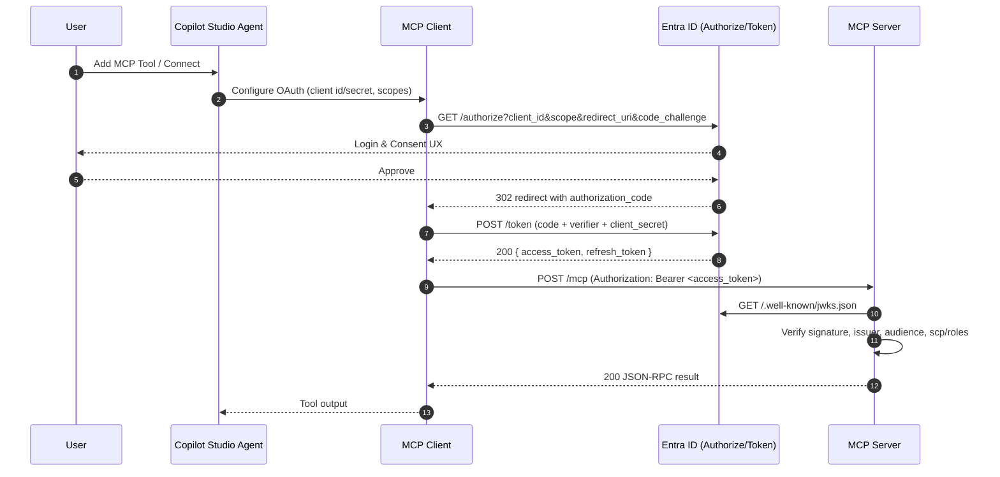
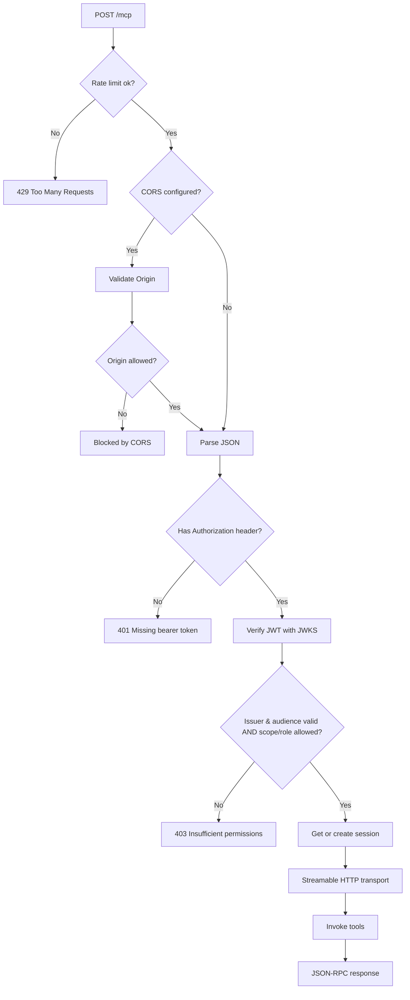

# MCP Demo Server (OAuth 2.0 via Microsoft Entra ID)

> Important: This project simulates SAP-like MCP tools for demos; it is **not** an SAP integration.

The service is built with the Model Context Protocol (MCP) TypeScript SDK and secures its HTTP transport with Microsoft Entra ID. It is frequently used together with Microsoft Dev Tunnels and Copilot Studio agents.

---

## Table of Contents

1. [5-Minute Quick Start](#5-minute-quick-start)
2. [Features](#features)
3. [Prerequisites](#prerequisites)
4. [Environment Variables](#environment-variables)
5. [Microsoft Entra ID Setup](#microsoft-entra-id-setup)
6. [Delegated vs Client Credentials](#delegated-vs-client-credentials)
7. [Start a Dev Tunnel](#start-a-dev-tunnel)
8. [Copilot Studio Setup](#copilot-studio-setup)
9. [Testing](#testing)
10. [Security Checklist](#security-checklist)
11. [Common Errors](#common-errors)
12. [Production Notes](#production-notes)
13. [Architecture Diagrams](#architecture-diagrams)
14. [Appendix: Example Values](#appendix-example-values)

---

## 5-Minute Quick Start

1. **Use Node 20 LTS**
   `nvm use 20` (or ensure `node --version` reports 20.x).
2. **Install dependencies**
   `npm install`
3. **Create your environment file**
   `cp .env.sample .env` and update:

   * `TENANT_ID`: your Microsoft Entra tenant GUID
   * `AUDIENCE`: the Application (client) ID or Application ID URI of the API app
   * `PORT`: optional (defaults to 3000)
4. **Start the dev server**
   `npm run dev` → [http://localhost:3000/mcp](http://localhost:3000/mcp)
5. **Expose the port (optional for Copilot Studio)**
   `devtunnel host -p 3000 --allow-anonymous`
6. **Type safety check (optional, fast)**
   `npm run typecheck`
7. **Production-style run**
   `npm start` automatically builds to `dist/` and launches the compiled server.

---

## Features

* Streamable HTTP MCP endpoint (`/mcp`) backed by `@modelcontextprotocol/sdk`.
* Simulated SAP-style tools with English descriptions and dynamic ETAs.
* OAuth 2.0 bearer validation with Microsoft Entra ID (v2 issuer) plus app roles/scopes.
* Security middleware: Helmet for headers, rate limiting, configurable CORS, UUID session IDs.
* Structured logging: Morgan for access logs, targeted auth diagnostics, process-level safeguards.

---

## Prerequisites

* **Node.js 20 LTS** (required)
* **npm** (ships with Node) or **pnpm**
* Microsoft **Dev Tunnels** CLI to expose the local port
* Microsoft **Entra ID** tenant with rights to create app registrations
* **Copilot Studio** environment with an agent

---

## Environment Variables

| Variable               | Required | Description                                                                                           | Example                                          |
| ---------------------- | -------- | ----------------------------------------------------------------------------------------------------- | ------------------------------------------------ |
| `TENANT_ID`            | Yes      | Tenant GUID (preferred) or domain.                                                                    | `ffffffff-ffff-ffff-ffff-ffffffffffff`           |
| `AUDIENCE`             | Yes      | Expected JWT `aud` claim: API App ID URI or GUID.                                                     | `api://ffffffff-ffff-ffff-ffff-ffffffffffff`     |
| `PORT`                 | No       | HTTP port for the Express server.                                                                     | `4044`                                           |
| `ALLOWED_SCOPES`       | No       | Space or comma separated list of delegated scopes that are accepted.                                  | `Mcp.Access access_as_mcp`                       |
| `ALLOWED_ROLES`        | No       | Comma separated list of app roles (client credentials) that are accepted.                             | `McpServer.Invoke,McpServer.Read`                |
| `CORS_ORIGIN`          | No       | Comma separated allowlist. Use `*` for any origin. Default: disabled in production, localhost in dev. | `https://contoso.com,https://portal.contoso.com` |
| `RATE_LIMIT_WINDOW_MS` | No       | Override the rate-limit window length (milliseconds). Default: 900000 (15 minutes).                   | `60000`                                          |
| `RATE_LIMIT_MAX`       | No       | Override the max number of requests allowed per window. Default: 100.                                 | `300`                                            |

> Tip: leave `CORS_ORIGIN` blank in production if the service is never called directly by browsers.

---

## Microsoft Entra ID Setup

Create two app registrations: one API (resource) and one client (Copilot Studio).

### 1. API App “MCP SAP API”

1. Register a new app (single tenant is fine).
2. **Expose an API**:

   * Set the Application ID URI (e.g. `api://<app-id-guid>`).
   * Add a **scope** named `Mcp.Access` with admin consent (full scope becomes `api://.../Mcp.Access`).
3. Optional: add **app roles** such as `McpServer.Invoke` for client credential flows.
4. Manifest: ensure `requestedAccessTokenVersion` is set to `2`.

### 2. Client App “MCP SAP Client (Copilot Studio)”

1. Register another app.
2. **Authentication** → **Add a platform** → **Web**.

   * Later copy the exact Redirect URI from the Copilot Studio wizard and paste it here (must match exactly).
3. **Certificates & secrets** → create a client secret and note it.
4. **API permissions** → **My APIs** → select your API app.

   * Delegated permission: `Mcp.Access`
   * (Optional) Application permissions: app roles you created earlier (`McpServer.Invoke` etc.)
5. Grant admin consent once permissions are configured.

Endpoints (v2.0):

* Authorization URL: `https://login.microsoftonline.com/{tenant}/oauth2/v2.0/authorize`
* Token URL: `https://login.microsoftonline.com/{tenant}/oauth2/v2.0/token`
* Refresh URL: same as token; include `offline_access` only for delegated flows.

---

## Delegated vs Client Credentials

| Scenario              | When to Use                                              | API Permissions Needed                                | Scope string to send to token endpoint               | Scope string for Copilot Studio          |
| --------------------- | -------------------------------------------------------- | ----------------------------------------------------- | ---------------------------------------------------- | ---------------------------------------- |
| Delegated (user flow) | Copilot Studio agent authenticates on behalf of a human. | Delegated: `Mcp.Access`                               | `api://<ApplicationIDURI>/Mcp.Access offline_access` | Same value as token request              |
| Client credentials    | Service-to-service automation; no user context.          | Application: `McpServer.Invoke` (or similar app role) | `api://<ApplicationIDURI>/.default`                  | Not used (Copilot Studio uses delegated) |

> Remember: Copilot Studio currently uses delegated auth. Client credentials are only needed for custom automation or testing tools.

---

## Start a Dev Tunnel

```bash
devtunnel user login
devtunnel host -p 3000 --allow-anonymous
# Copy the public https URL and append /mcp for Copilot Studio.
```

---

## Copilot Studio Setup

> Add the MCP server from your agent: **Agent → Tools → Add tool → Model Context Protocol**.

1. **Server details**

   * Name: e.g. `SAP (simulated)`
   * Server URL: `https://<devtunnel-host>/mcp`
   * Transport: Streamable HTTP (default)
2. **Authentication: OAuth 2.0 (Manual)**

   * Client ID / Secret: from the client app
   * Authorization URL: `https://login.microsoftonline.com/<TENANT_ID>/oauth2/v2.0/authorize`
   * Token + Refresh URL: `https://login.microsoftonline.com/<TENANT_ID>/oauth2/v2.0/token`
   * Scopes: `api://<ApplicationIDURI>/Mcp.Access offline_access`
3. When the wizard shows a Redirect URL, copy it to **Azure Portal → Client app → Authentication → Web Redirect URIs** and save.
4. Create the connection, sign in, and consent.

---

## Testing

### Health check

```bash
curl http://localhost:3000/health
# -> { "ok": true, "mcp": "/mcp" }
```

### MCP Inspector (CLI)

```bash
npx @modelcontextprotocol/inspector@0.16.2 --cli \
  curl http://localhost:3000/mcp --method tools/list
```

### Direct MCP call (no token)

```bash
curl -X POST http://localhost:3000/mcp \
  -H "Content-Type: application/json" \
  -d '{"jsonrpc":"2.0","id":"1","method":"tools/list"}'
# -> 401 Missing bearer token
```

### Client credentials token (optional)

```bash
curl -X POST \
  -H "Content-Type: application/x-www-form-urlencoded" \
  -d "client_id=<CLIENT_ID>" \
  -d "client_secret=<CLIENT_SECRET>" \
  -d "grant_type=client_credentials" \
  -d "scope=api://<ApplicationIDURI>/.default" \
  "https://login.microsoftonline.com/<TENANT_ID>/oauth2/v2.0/token"
```

---

## Security Checklist

* `npm run typecheck` and `npm run build` before deploying; the build output lives in `dist/`.
* Keep `NODE_ENV=production` in production runs to enable leaner logging.
* Configure `CORS_ORIGIN` explicitly; leave blank to disable browser access.
* Tune `RATE_LIMIT_MAX` / `RATE_LIMIT_WINDOW_MS` if you expect higher throughput.
* Rotate your client secrets regularly; use Azure Key Vault or managed identities when possible.
* Monitor logs for repeated 401/403 responses; every MCP request is tagged with a unique session ID.

---

## Common Errors

* **401 Missing/invalid token**
  Ensure the Copilot Studio connection references the correct tenant and audience. Check the consented scopes.
* **403 Insufficient permissions**
  The token must contain at least one allowed scope (`scp`) or app role (`roles`). Compare the response body with your Azure configuration.
* **Redirect URI mismatch**
  The wizard-generated URI must be pasted into Azure → Client app → Authentication before you create the connection.
* **CORS blocked by browser**
  Set `CORS_ORIGIN` to include the exact browser origin (protocol + host + port) or disable browser access.
* **429 Too many requests**
  Increase `RATE_LIMIT_MAX` or widen `RATE_LIMIT_WINDOW_MS` for trusted traffic sources.

---

## Production Notes

* `npm start` triggers a fresh `npm run build` (via `prestart`) to ensure `dist/` is in sync.
* Serve behind HTTPS and ensure secrets are stored securely (Key Vault, environment variables, etc.).
* Consider running behind a reverse proxy that terminates TLS and adds additional rate limiting / monitoring.
* Watch for `unhandledRejection` or `uncaughtException` logs; the process exits after logging to avoid “zombie” states.

---

## Architecture Diagrams

### 1) System Context (high-level)

```mermaid
graph TD
  subgraph UserSpace["User & Copilot Studio"]
    U[Human User]
    A[Copilot Studio Agent]
    MCPClient[MCP Client]
  end

  subgraph Net["Network / Tunnels"]
    DT[Microsoft Dev Tunnels (*.devtunnels.ms)]
  end

  subgraph Server["MCP Demo Server"]
    E[Express App]
    M[/POST /mcp/]
    SM[Session Manager]
    Tools[Simulated Tools]
  end

  subgraph Auth["Microsoft Entra ID v2"]
    Authz[Authorize Endpoint]
    Token[Token Endpoint]
    JWKS[JWKS Keys]
  end

  U --> A --> MCPClient
  MCPClient --> Authz
  Authz --> Token
  MCPClient -->|Bearer JWT| DT --> E --> M --> SM --> Tools
  E --> JWKS
```

**Notes**

* Trust boundary between **UserSpace** and **Server** is the Dev Tunnel or reverse proxy.
* The server accepts tokens from **Entra ID (v2)** and validates them against **JWKS**.

---

### 2) OAuth 2.0 Authorization Code Flow (delegated)



**Key checks on the server**

* `iss` ∈ `https://login.microsoftonline.com/<TENANT_ID>/v2.0`
* `aud` == `AUDIENCE`
* `scp` contains one of `ALLOWED_SCOPES` **or** `roles` contains one of `ALLOWED_ROLES`

---

### 3) HTTP Request Lifecycle for `/mcp`



---

### 4) Topology (Dev vs. Production)

```mermaid
graph LR
  subgraph Dev
    DevUser[Developer]
    DevUser -->|localhost:3000| DevSrv[Express/MCP Server]
    DevSrv -.->|devtunnel host -p 3000| DevTunnel[Dev Tunnels]
    DevTunnel --> Copilot[Copilot Studio]
  end

  subgraph Prod
    LB[Reverse Proxy / Ingress (TLS)]
    LB --> ProdSrv[Express/MCP Server]
    ProdSrv --> KeyVault[(Secrets)]
    Copilot --> LB
  end

  ProdSrv --> Logs[(Observability)]
```

**Notes**

* In dev, set `TRUST_PROXY=1` for correct client IP parsing behind Dev Tunnels / reverse proxies.
* In prod, terminate TLS at your proxy/ingress, forward to Node, and keep `NODE_ENV=production`.

---

## Appendix: Example Values

```
Server URL: https://abcdefg-3000.euw.devtunnels.ms/mcp
Authorization URL: https://login.microsoftonline.com/ffffffff-ffff-ffff-ffff-ffffffffffff/oauth2/v2.0/authorize
Token/Refresh URL: https://login.microsoftonline.com/ffffffff-ffff-ffff-ffff-ffffffffffff/oauth2/v2.0/token
Scopes (delegated): api://ffffffff-ffff-ffff-ffff-ffffffffffff/Mcp.Access offline_access
Client credentials scope: api://ffffffff-ffff-ffff-ffff-ffffffffffff/.default
Redirect URL (wizard): https://global.consent.azure-apim.net/redirect/...
```
